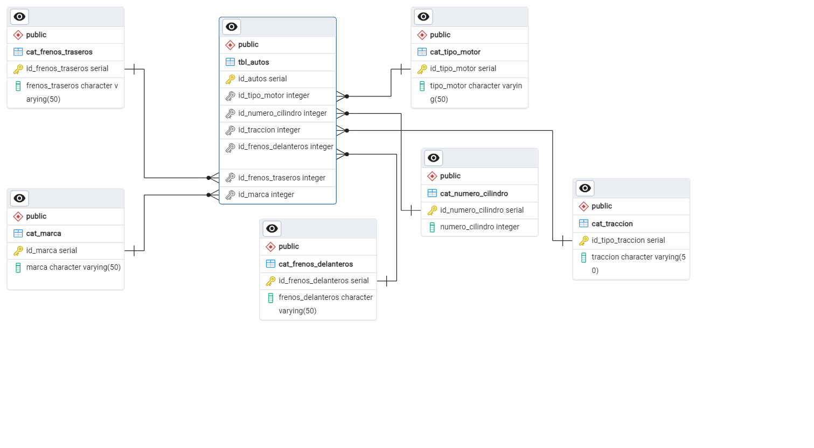

# proyecto_final
proyecto_final_curso
 
 *Autor* Edgar Vazquez Ramirez

 ## Descripcion 
• 1986: Inicio del proyecto POTGRES
• 1996: Renombramiento a PostgreSQL 6.0
• 2005: Lanzamiento de PostgreSQL 8.0 (soporte nativo para Windows)
• 2010: PostgreSQL 9.0 (replicación streaming, Hot Standby)
• 2016: PostgreSQL 9.6 (mejoras en paralelización de consultas)
• 2020: PostgreSQL 13 (optimización de índices, nuevas características de seguridad)


## 1.- Obtención de datos


Los datos los obtuve fueron de la [pagina](https://coche.car2db.com/excel/) la pag. permite descargar varias bases de datos.

 

# 1.- Modelado de Datos

   Modelo Conceptual:

El diagrama de entidad-relación (DER) 
Define las entidades, atributos y relaciones.
Por ejemplo:
* Entidades: Cliente, Producto, Pedido. 
* Atributos: ID, Nombre, Precio.
* Relaciones: Cliente realiza Pedido, Pedido contiene Producto.

    Modelo Lógico:
Traduce el modelo conceptual a un modelo lógico utilizando el modelo relacional.
Define tablas, claves primarias y foráneas.
Normaliza las tablas para evitar redundancia y anomalías.


     Modelo Físico:
Decide sobre el motor de base de datos (PostgreSQL).
Crea las tablas en SQL con las columnas y restricciones adecuadas.

    Integridad y Seguridad:
Agrega restricciones de integridad (claves primarias, foráneas, restricciones UNIQUE, etc.).
Define permisos de acceso para usuarios y roles.

 


 Diseño de la base de datos

 La siguiente base de datos esta diseñada para verificar algunas marcas de vehiculos con diferentes tipo de combustible que tipo de frenos tiene o tipo de traccion. 

```sql
CREATE TABLE IF NOT EXISTS public.cat_marca
(
    id_marca serial NOT NULL,
    marca character varying(50) NOT NULL,
    PRIMARY KEY (id_marca)
);

CREATE TABLE IF NOT EXISTS public.cat_tipo_motor
(
    id_tipo_motor serial NOT NULL,
    tipo_motor character varying(50) NOT NULL,
    PRIMARY KEY (id_tipo_motor)
);

CREATE TABLE IF NOT EXISTS public.tbl_autos
(
    id_autos serial NOT NULL,
    id_tipo_motor integer NOT NULL,
    id_numero_cilindro integer NOT NULL,
    id_traccion integer NOT NULL,
    id_frenos_delanteros integer NOT NULL,
    id_frenos_traseros integer NOT NULL,
    id_marca integer NOT NULL,
    PRIMARY KEY (id_marca)
);

CREATE TABLE IF NOT EXISTS public.cat_numero_cilindro
(
    id_numero_cilindro serial NOT NULL,
    numero_cilindro integer NOT NULL,
    PRIMARY KEY (id_numero_cilindro)
);

CREATE TABLE IF NOT EXISTS public.cat_traccion
(
    id_tipo_traccion serial NOT NULL,
    traccion character varying(50) NOT NULL,
    PRIMARY KEY (id_tipo_traccion)
);

CREATE TABLE IF NOT EXISTS public.cat_frenos_delanteros
(
    id_frenos_delanteros serial NOT NULL,
    frenos_delanteros character varying(50) NOT NULL,
    PRIMARY KEY (id_frenos_delanteros)
);

CREATE TABLE IF NOT EXISTS public.cat_frenos_traseros
(
    id_frenos_traseros serial NOT NULL,
    frenos_traseros character varying(50) NOT NULL,
    PRIMARY KEY (id_frenos_traseros)
);

ALTER TABLE IF EXISTS public.tbl_autos
    ADD FOREIGN KEY (id_tipo_motor)
    REFERENCES public.cat_tipo_motor (id_tipo_motor) MATCH SIMPLE
    ON UPDATE NO ACTION
    ON DELETE NO ACTION
    NOT VALID;


ALTER TABLE IF EXISTS public.tbl_autos
    ADD FOREIGN KEY (id_numero_cilindro)
    REFERENCES public.cat_numero_cilindro (id_numero_cilindro) MATCH SIMPLE
    ON UPDATE NO ACTION
    ON DELETE NO ACTION
    NOT VALID;


ALTER TABLE IF EXISTS public.tbl_autos
    ADD FOREIGN KEY (id_traccion)
    REFERENCES public.cat_traccion (id_tipo_traccion) MATCH SIMPLE
    ON UPDATE NO ACTION
    ON DELETE NO ACTION
    NOT VALID;


ALTER TABLE IF EXISTS public.tbl_autos
    ADD FOREIGN KEY (id_frenos_delanteros)
    REFERENCES public.cat_frenos_delanteros (id_frenos_delanteros) MATCH SIMPLE
    ON UPDATE NO ACTION
    ON DELETE NO ACTION
    NOT VALID;


ALTER TABLE IF EXISTS public.tbl_autos
    ADD FOREIGN KEY (id_frenos_traseros)
    REFERENCES public.cat_frenos_traseros (id_frenos_traseros) MATCH SIMPLE
    ON UPDATE NO ACTION
    ON DELETE NO ACTION
    NOT VALID;


ALTER TABLE IF EXISTS public.tbl_autos
    ADD FOREIGN KEY (id_marca)
    REFERENCES public.cat_marca (id_marca) MATCH SIMPLE
    ON UPDATE NO ACTION
    ON DELETE NO ACTION
    NOT VALID;

END;
```
 Configuración del entorno SQL

Comandos básicos y avanzados
Aperendi en clase a crear una tabla desde SQL Shell

 


 ## Gestión de usuarios
 los términos “usuarios”, “grupos” y “roles” los usuarios tienen permiso para iniciar sesión de forma predeterminada "superusuario".
Puedes crear un usuario utilizando la siguiente instrucción SQL:
Creamos un usario, debemos estar conectados como super usario para poder dar privilegios, ponemos el nombre del usario que queremos crear. 

 

 

 


 ## Creando una copia de seguridad

 Crear y restaurar copias de seguridad es una gestión de bases de datos, podemos asegurar los datos que esten protegidos y sean recuperables en caso de fallos o pérdida de datos.

Ejemplo Paso a Paso
Se describen los pasos para mayor detalle:

Paso 1: Abrir pgAdmin y Conectarse al Servidor

Paso 2: Seleccionar la Base de Datos

Paso 3: Abrir el Menú de Copia de Seguridad


Paso 4: Configurar la Copia de Seguridad


Paso 5: Ejecutar la Copia de Seguridad


 ## Optimizando consultas

    # Objetivo

Optimizar el rendimiento de PostgreSQL y sus consultas mediante técnicas de ajuste, manejo de transacciones y uso eficiente de índices.

# Tipos de índices y su uso

Configura los parámetros para optimizar el rendimiento:
- shared_buffers: Asigna memoria a los búferes compartidos.
- work_mem: Ajusta la memoria para operaciones de ordenamiento y hash.
- effective_cache_size: Define la memoria para el almacenamiento en caché de datos.

1.- Índices (Indexes):


CREATE INDEX idx_nombre_columna ON tabla (nombre_columna);

* Los índices son estructuras que mejoran la velocidad de las consultas en una tabla.
* Para crear un índice en PostgreSQL, puedes usar la sentencia CREATE INDEX.
Tipos de Índices
- B-tree (por defecto): Bueno para la mayoría de las consultas.
- Hash: Útil para igualdad simple.
- GiST, GIN, SP-GiST: Útiles para búsquedas complejas y tipos de datos específicos.
- BRIN: Eficiente para columnas que tienen datos ordenados de manera natural.

El comando EXPLAIN muestra el plan de ejecución que PostgreSQL utilizará para una consulta. EXPLAIN ANALYZE ejecuta la consulta y muestra tiempos reales.

 Creamos una consulta 


Creacion de indice


Análisis de Consultas con EXPLAIN


Consulta con JOIN


 ## Preparando un proceso de réplica y alta disponibilidad


 ## Preparando el monitoreo


 ## Migración de datos


 ## Presentación del proyecto


