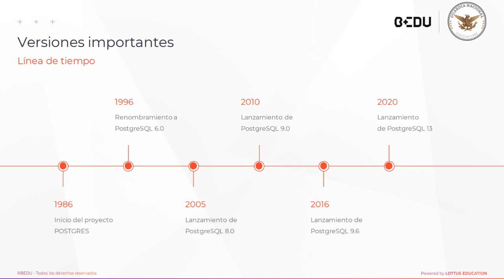

# proyecto_final
proyecto_final_curso
 
 *Autor* Edgar Vazquez Ramirez

 ## Descripcion 
• 1986: Inicio del proyecto POTGRES
• 1996: Renombramiento a PostgreSQL 6.0
• 2005: Lanzamiento de PostgreSQL 8.0 (soporte nativo para Windows)
• 2010: PostgreSQL 9.0 (replicación streaming, Hot Standby)
• 2016: PostgreSQL 9.6 (mejoras en paralelización de consultas)
• 2020: PostgreSQL 13 (optimización de índices, nuevas características de seguridad)

## Caracteristicas

 Diseño de la base de datos

 La siginte base de datos esta diseñada para verificar algunas marcas de vehiculos con diferentes tipo de combustible que tipo de frenos tiene o tipo de traccion. 

CREATE TABLE IF NOT EXISTS public.cat_marca
(
    id_marca serial NOT NULL,
    marca character varying(50) NOT NULL,
    PRIMARY KEY (id_marca)
);

CREATE TABLE IF NOT EXISTS public.cat_tipo_motor
(
    id_tipo_motor serial NOT NULL,
    tipo_motor character varying(50) NOT NULL,
    PRIMARY KEY (id_tipo_motor)
);

CREATE TABLE IF NOT EXISTS public.tbl_autos
(
    id_autos serial NOT NULL,
    id_tipo_motor integer NOT NULL,
    id_numero_cilindro integer NOT NULL,
    id_traccion integer NOT NULL,
    id_frenos_delanteros integer NOT NULL,
    id_frenos_traseros integer NOT NULL,
    id_marca integer NOT NULL,
    PRIMARY KEY (id_marca)
);

CREATE TABLE IF NOT EXISTS public.cat_numero_cilindro
(
    id_numero_cilindro serial NOT NULL,
    numero_cilindro integer NOT NULL,
    PRIMARY KEY (id_numero_cilindro)
);

CREATE TABLE IF NOT EXISTS public.cat_traccion
(
    id_tipo_traccion serial NOT NULL,
    traccion character varying(50) NOT NULL,
    PRIMARY KEY (id_tipo_traccion)
);

CREATE TABLE IF NOT EXISTS public.cat_frenos_delanteros
(
    id_frenos_delanteros serial NOT NULL,
    frenos_delanteros character varying(50) NOT NULL,
    PRIMARY KEY (id_frenos_delanteros)
);

CREATE TABLE IF NOT EXISTS public.cat_frenos_traseros
(
    id_frenos_traseros serial NOT NULL,
    frenos_traseros character varying(50) NOT NULL,
    PRIMARY KEY (id_frenos_traseros)
);

ALTER TABLE IF EXISTS public.tbl_autos
    ADD FOREIGN KEY (id_tipo_motor)
    REFERENCES public.cat_tipo_motor (id_tipo_motor) MATCH SIMPLE
    ON UPDATE NO ACTION
    ON DELETE NO ACTION
    NOT VALID;

ALTER TABLE IF EXISTS public.tbl_autos
    ADD FOREIGN KEY (id_numero_cilindro)
    REFERENCES public.cat_numero_cilindro (id_numero_cilindro) MATCH SIMPLE
    ON UPDATE NO ACTION
    ON DELETE NO ACTION
    NOT VALID;

ALTER TABLE IF EXISTS public.tbl_autos
    ADD FOREIGN KEY (id_traccion)
    REFERENCES public.cat_traccion (id_tipo_traccion) MATCH SIMPLE
    ON UPDATE NO ACTION
    ON DELETE NO ACTION
    NOT VALID;

ALTER TABLE IF EXISTS public.tbl_autos
    ADD FOREIGN KEY (id_frenos_delanteros)
    REFERENCES public.cat_frenos_delanteros (id_frenos_delanteros) MATCH SIMPLE
    ON UPDATE NO ACTION
    ON DELETE NO ACTION
    NOT VALID;

ALTER TABLE IF EXISTS public.tbl_autos
    ADD FOREIGN KEY (id_frenos_traseros)
    REFERENCES public.cat_frenos_traseros (id_frenos_traseros) MATCH SIMPLE
    ON UPDATE NO ACTION
    ON DELETE NO ACTION
    NOT VALID;

ALTER TABLE IF EXISTS public.tbl_autos
    ADD FOREIGN KEY (id_marca)
    REFERENCES public.cat_marca (id_marca) MATCH SIMPLE
    ON UPDATE NO ACTION
    ON DELETE NO ACTION
    NOT VALID;

END;

 ## Sesión 02: Arquitectura y Componentes Internos de PostgreSQL
 

## Sesión 03: Herramientas y Utilidades (PSQL & PgAdmin 4)

Instalación de PostgreSQL y PgAdmin 4

* Instalación en Windows

Comandos básicos y avanzados
Aperendi en clase a crear una tabla desde SQL Shell
 

Interfaz de usuario
Navegación y administración básica

 # Diseño de la base de datos
 

# Consultas SQL